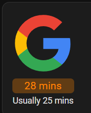

[](https://my.home-assistant.io/redirect/hacs_repository/?owner=Saucepwn&repository=travel-time-card&category=plugin)

# travel-time-card

Home Assistant lovelace card to display travel times from the Google Maps Travel Time service



The card will render the travel time as green, orange, or red depending on how much traffic is expected en route.

## Getting Started

First, add the Google Maps Travel Time service, which ships as a default Home Assistant add on.

### Google Maps Travel Time Configuration

1) In Home Assistant, navigate to Settings > Devices & Services > Integrations
2) Click (+ Add Integration)
3) Add Google > Google Maps Travel Time
4) Configure the service with your origin and destination

### Card Configuration

```
type: custom:travel-time-card
entity: sensor.drive_to_google
image_url: /local/google_logo.svg
```

In the above example, the file `google_logo.svg` is placed in `/www/google_logo.svg`

## Configuration

## Options

| Name              | Type    | Requirement  | Description                                 | Default             |
| ----------------- | ------- | ------------ | ------------------------------------------- | ------------------- |
| type              | string  | **Required** | `custom:travel-time-card`                   |                     |
| entity            | string  | **Required** | Google Maps Travel Time entity              |                     |
| image_url         | string  | **Optional** | Shows an image at the top of the card       |                     |
| title             | string  | **Optional** | If no image is specified, show a text title |                     |
